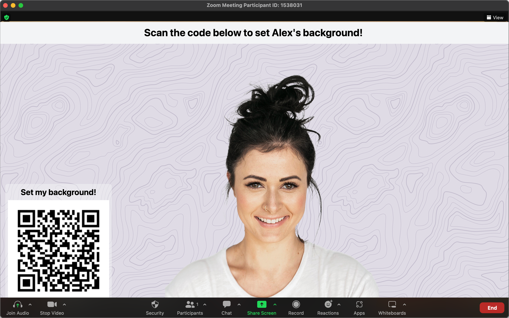

Spice up meetings or create engaging streams by crowd-sourcing your virtual background with Rent My Background!



---

## About

This project provides a URL that can be used as a Web scene in OBS. Combined with a background removal filter, you can turn the URL into your virtual background. The background presents viewers with a QR Code that, when scanned, allows users to submit an image file to set as your virtual background. Backgrounds are uploaded to Firebase and expire after a time set in your profile. Once expired, the files are removed, and the next background in the queue is displayed.

## Building

1. `yarn install`
2. Create a `.env.local` file and fill in the following with your own Firebase settings

```js
NEXT_PUBLIC_FIREBASE_PUBLIC_API_KEY = "";
NEXT_PUBLIC_FIREBASE_AUTH_DOMAIN = "";
NEXT_PUBLIC_FIREBASE_PROJECT_ID = "";
NEXT_PUBLIC_EMAIL_SIGNUP_LINK = "";
NEXT_PUBLIC_FIREBASE_MESSAGING_SENDER_ID = "";
NEXT_PUBLIC_FIREBASE_STORAGE_BUCKET = "";
NEXT_PUBLIC_BACKGROUND_RENDERER_LINK = "";
NEXT_PUBLIC_BACKGROUND_SUBMISSION_LINK = "";
```

3. `yarn build`
4. Visit `localhost:3000`
